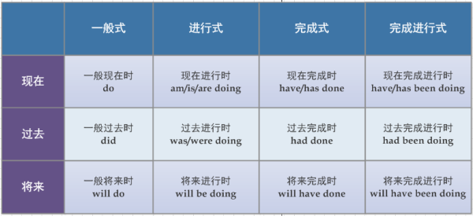

# 补充

1. 时态
1. 英语语法的框架、轮廓
1. ...

先把英语语法的大致框架捋清，避免一头扎进各个琐碎的知识点中，只见树木，不见森林。

要搞清的一些知识点：

- 16 种时态
- 2 种语态 (主动、被动)
- 3 种语气 (陈述、祈使、虚拟语气)
- 倒装
- 句子成分
- 肯定句，否定句，一般疑问句，特殊疑问句
- 非谓语
  - 不定式 (to + 动词原形)
  - 动名词 (动词-ing)
  - 分词
    - 现在分词 (动词-ing)
    - 过去分词 (动词-ed)
- 从句 (TODO)
- ...

## 时态

Ref：[知乎 - 如何准确使用时态](https://www.zhihu.com/question/31924369)
- [回答 1](https://www.zhihu.com/question/31924369/answer/196401680)
- [回答 2](https://www.zhihu.com/question/31924369/answer/53919190)
- [回答 3](https://www.zhihu.com/question/31924369/answer/138024691)

什么是时态? 时态就是表示一个动作发生的**时间**和所处的**状态**。

- "时" (tense) 就是这个动作发生的 "时间"
- "态" (aspect，又叫体) 就是这个动作在某个时刻的 "状态"

时：

- 过去时 (past)
- 现在时 (now)
- 将来时 (future)
- (过去将来时...)

态：

- 一般式：经常发生的动作，动词形式为 do
  - I often get up at 7.
- 进行式：正在进行的动作，动词形式为 "be 动词 + doing"
  - She is singing a French song.
- 完成式：对 "之前发生动作" 的一个总结，动词形式为 "have + done"
  - They have found the missing child.
- 完成进行式：对 "正在进行动作" 的一个总结，其动词形式为 "have + been + doing"
  - I have been reading books for 2 hours.

在英文中，时被称为 tense，而态，实际叫体，英文为 aspect。因此上面四种态又分别叫：

- 一般体 (simple aspect)
- 进行体 (progressive aspect)
- 完成体 (perfect aspect)
- 完成进行体 (perfect progressive aspect)

(perfect --> 完成，这也行...)

因此，四种时和四种态组合起来，就形成了英语语法中的十六种时态 (妈呀!)...

(上图中略去了过去将来时)

## 英语语法的框架、轮廓

Ref：[知乎 - 怎么学好英语语法](https://www.zhihu.com/question/24485886)
- [回答 1](https://www.zhihu.com/question/24485886/answer/215964793)

词性和句子成分：

1. 词性：名词，动词，形容词，介词，代词和副词。
2. 句子成分：主语，谓语，宾语，表语，定语，状语，补语。

一种词性可以充当多个句子成分，一种句子成分也可以由多种词性充当。

- 名词，可以充当主语、宾语、表语 (所以像主语、宾语被称为名词性句子成分)。

- 动词，一般就充当谓语了，但动词的动名词和不定式具有名词性质，可以充当主语 (即所谓的非谓语，动词充当不是谓语的成分)。

- 形容词，修饰名词，一般充当定语，还可以作为表语、补语。
  - I like beautiful flowers. (定语)
  - The flowers are beautiful. (表语)
  - He makes her happy. (补语)

- 介词，介词 + n，充当状语，修饰动词。
  - He went to Beijing by airplane. (to Bejing, by airplane)

- 代词，名词性质，充当主语等名词性句子成分。

- 副词，修饰动词或形容词，充当状语。
  - He speaks loudly.

句子成分：

- 主语：动作的执行者
- 谓语：动作
- 宾语：动作的接受者
- ...

五种简单句：

1. 主 + 谓

   You jump, I jump.

   你跳，我也跳。

1. 主 + 谓 + 宾

   I see you.

   我懂你

1. 主 + 谓 + 宾 + 宾

   I gave him my book.

   我把我的书给他了。

1. 主 + 谓 + 宾 + 补

   Love makes man grow up or sink down.

   爱使人成长，也使人沉沦。

1. 主 + 系 + 表

   You are my world.

   你是我的全世界。

定状补：

- He went to Beijing **by plane**.

  他**坐飞机**去北京。

- I didn't sleep **yesterday**.

  我**昨天**没睡觉。

- He had lunch **at 3 p.m**.

  他**下午三点**吃的午饭。

- He chatted with me **on Weixin**.

  他**在微信上**和我聊天。

汉语和英语的区别：

- 汉语是：主语 + 废话 + 谓语 + 宾语。
- 英语是：主语 + 谓语 + 宾语 + 废话。

定状补，就是废话。除了主谓宾或主系表之外的成分，都是废话。

(这么一看，还真是耶，从上面例子来看，汉语把一句话的动词部分放在句子尾部，但不是最后，最后是宾语，和日语几乎一样，日语的宾语在动词谓语前，日语中动词谓语是真的在最后面。)

(谓语的英文原文是什么，为什么翻译成 "谓" 呢，很难理解。)

英语语法的一个黄金法则：一句话的主句里面，只能有一个谓句。如果一句话有多个动词，找出最重要的动词，然后其它动词用 **连词**、**非谓语**、**从句** 搞定。

## 句子成分

Ref：[英语句子成分知识](http://www.yygrammar.com/Article/200805/295.html)

根据英语词汇在英语句子中的地位和作用, 英语句子的成分可分为主语、谓语、宾语、宾语补足语、表语、定语、状语、同位语及独立成分等。其中，主语和谓语是句子的主要成分，一般情况下，一个句子不能缺少这两种成分。

1. 主语：表示句子所要说明或描述的人或事物，一般由名词、代词或相当于名词的词组或句子充当，置于句首。如：

   - It’s getting cold. 天冷起来了。
   - Now everything is ready. 现在一切都准备好了。
   - The teacher is very kind to us. 老师对我们很好。

2. 谓语：说明或描述主语的动作、状态或特征，由动词或动词短语充当，位于主语之后。如：

   - Mother bought me a VCR. 妈给我买了一台录像机。
   - We have finished our work already. 我们已经完成了工作。

3. 表语：表示主语的身份、性质、状态和特征，一般由名词、形容词、或相当于名词、形容词的词、短语或句子充当，位于连系动词之后，与连系动词一起构成句子的谓语。如：

   - Be careful! 小心!
   - He looks very angry. 他看上去很生气。
   - His job is looking after sheep. 他的任务是看羊。

4. 宾语：指动作所涉及的人或事物，一般由名词、代词或相当于名词的词组或句子充当，位于动词之后。如：

   - He wrote many plays. 他写了许多剧本。
   - She loves swimming. 她喜欢游泳。

5. 宾语补足语：用来对宾语进行补充和说明，一般由名词、非谓语动词、形容词等充当。如：

   - He told us to stay. 他叫我们留下。
   - I’ve never seen her dancing. 我从未看见过她跳舞。
   - I found it difficult to refuse him. 我感到很难拒绝他。

6. 定语：对名词或代词进行修饰、限制或说明，一般由形容词、名词、代词、数词、介词短语、非谓语动词及句子等充当，位置可在所修饰的词之前，也可在所修饰的词之后 (详见形容词一章)。如：

   - It’s an interesting story. 那是一个有趣的故事。
   - Do you have time to help us? 你有时间帮助我们吗?
   - Who is the woman being operated on? 正在动手术的女人是谁?

7. 状语：用于修饰动词、形容词、副词、短语或整个句子等，一般由副词、介词短语、非谓语动词短语或句子充当。如：

   - We like English very much. 我们非常喜欢英语。
   - Her uncle lives in Canada. 她叔叔住在加拿大。
   - She was lying in bed reading. 她躺在床上看书。
   - United we stand, divided we fall. 团结则存，分裂则亡。

8. 同位语：若两个语法单位指同一个人或事物，并且，句法功能也一样，那么，后一项称为前一项的同位语。如：

   - This is my friend Harry. 这是我的朋友哈利。
   - We students should study hard. 我们学生应该努力学习。

9. 独立成分：与句子其他成分没有通常的语法关系，如插入语、感叹语、呼语等，一般用逗号将它与句子隔开。如：

   - He’s a nice person, to be sure. 肯定他是一个好人。
   - Strange to say, he did pass his exam after all. 说也奇怪，考试他竟然通过了。

由上可见，非谓语动词，功能很强大啊。

I found it difficult to refuse him.

it 是形式宾语，to refuse him 是真正宾语，非谓语，difficult 是宾补。

表语为什么不是宾语，因为它不是动作的对象。看这个例句：

- He looks very angry.

"angry" 很明显不是宾语。实际表语是对主语的补充说明，它是主语补足语。表语可以是形容词或名词，但宾语只能是名词性质的词。

## 特殊疑问句

Ref：[英语特殊疑问句简介](http://www.yygrammar.com/article/201109/2532.html)

以疑问词开头的疑问句：

- 5W1H (何时，何地，何人，何事，何因，方式)
  - when / where / who / what / why / how
- whose / which
- how many, how much, how old ...
- what color, what year, what class ...

两种句型：

1. 疑问词 + 一般疑问句

   - When did you see him?
   - Where are you from?
   - How did you arrive here?
   - Why are you late again?
   - Which book did you buy?

   这种疑问句问的一般是陈述句中的状语或宾语成分，表示时间、地点、方式、原因等。

1. 疑问词 + 陈述句语序，此时的疑问词在句子中作主语，或修饰主语

   - Who can answer this question?
   - Who sings best?
   - Which book is more cheap?

省略形式 (固定使用)：

- Why not use both?

  why not 后跟动词原形。

- What about having a rest?

  what about 后跟名词或动名词。

## 非谓语动词

我的理解。为什么中国人理解非谓语动词会很困难，这跟中文的语法有关系。以这个句子为例："说很简单，做很难"，看似主语直接是动词 "说" 和 "做"，但其实这里隐含的意思是说，"说话-这件事情，很简单，做-这件事情，很难"，因此，主语并非是直接的动词。在日语里，动词不能像中文这样直接拿来当主语，必须显式地在动词后面加上 "こと"，来表明 "动作这件事情"，从而把它变成名词属性，可以充当主语等成分。

(再举一个长一点的例子，比如 "捏死你就跟捍死一只蚂蚁一样"，隐含的意思是说 "捏死你-这件事情，就跟，捏死一只蚂蚁-这件事情，一样"。)

英语同样如此，我们不能直接说 "Say is easy"，不能直接用动词充当主语，必须给它加点类似 "こと" 的东西，把 "Say" 变成名词属性，在英语中，我们用动名词或不定式来实现，即 "Saying is easy"，或 "To say is easy"，此时，"saying" 或 "to say" 就具有了名词属性，它们可以充当主语。动词充当不是谓语的成分，这就是非谓语动词的来源。

只要在句子中充当的是不是谓语成分的动词，那统统都可以认为是非谓语动词。

动名词和现在分词具有相同的形式，即 -ing 形式，但它们的作用是完全不一样的。动名词，顾名思义，它充当的是名词属性，和不定式一样。因为名词可以充当主语、宾语、表语、补语等，它们也可以充当这些成分。

而分词，无论是现在分词还是过去分词，它们不起名词的作用，而是起形容词和副词的作用，因此可作表语、定语、状语等成分，但不能做名词属性的主语和宾语。

- 名词属性 - 充当主语、宾语等名词属性的名子成分
  - 不定式 - 表将来或具体的动作
  - 动名词 - 表示已完成或一般的动作
- 形容词或副词属性 - 充当表语、定语、状语等形容词或副词属性的句子成分
  - 现在分词 - 主动和正在进行的动作
  - 过去分词 - 被动和完成的动作

不定式和动名词充当主语或宾语时，如果表述太长，经常会用 it 来作形式语式或形式宾语。

不定式的 to 在一些习惯用法中可以省略，比如 "help sb. do sth."，"have sb. do sth."。

- [不定式省略 to 的九种情况](http://www.hjenglish.com/new/p37943/)

注意，句子中的有些 "to" 是介词，而不是动词不定式的 "to"，这些 "to" 往往是和一些动词的固定搭配，后面要跟动名词形式。比如 "be used to"，习惯于做某事，这个 "to" 是介词，因此后面要跟 doing。

区分 "to" 是介词还是不定式中的 "to"，一个简单 (但不是 100% 适用) 的办法是判断这个 "to" 后面能不能接名词，如果可以接名词，那就是介词，否则一般是属于不定式的 "to"，比如 "pay attention to"，后面可以接名词，那么这个 "to" 就是介词，如果后面要接动词，那就要用动名词形式，而不是动词原形。而 "want to"，后面不能接名词，不能说 "want to an apple" (而是 "want an apple")，所以这里的 "to" 是属于不定式的 "to"，后面如果要接动词，则用动词原形，"want to sleep"。

Ref：[非谓语动词所表示动词的基本特点](http://www.yygrammar.com/Article/201701/4963.html)

在句子中不能作谓语的动词形式叫非谓语动词。非谓语动词有不定式、动名词、现在分词和过去分词。动名词和现在分词的形式相同，可统称为动词的 -ing 形式；现在分词与过去分词在句中的作用相同，可统称为分词。

- 不定式 (to play)
- -ing
  - 动名词 (playing)
  - 现在分词 (playing)
- 分词
  - 现在分词 (playing)
  - 过去分词 (played)

非谓语动词的总体用法特点是：

- 不定式表示将来 (谓语之后) 的或具体的动作
- 动名词表示已完成的或一般的动作
- 现在分词表示主动和正在进行的动作
- 过去分词表示被动和完成的动作

例句：

- The meeting to be held tomorrow is very important. 明天要开的会议很重要。
- The meeting being held now is very important. 现在正开的会议相当重要。
- The meeting held yesterday is very important. 昨天开的会议相当重要。

非谓语可以在句子中充当很多种成分，唯独不能作谓语。它可以作主语、定语、补语等。

Ref：[非谓语动词用法精讲](http://www.for68.com/new/2007/7/wa733834630172770029718-0.htm)

非谓语动词分为三类：不定式（infinitive）、动名词（gerund）和分词（participle）。其特点是：

1. 不定式、动名词和分词可以做很多句子成分，但就是不能单独做谓语，这也是它们被称为 "非谓语动词" 的原因。
1. 它们具有各种形态：原形、主动态、被动态、进行态和完成态。
1. 不定式和动名词可以做主语、宾语、表语、补语等。但不管起什么作用，它们都具有动词的功能，但无语法上的动词性质，这一点可以通过它们不受主语的人称和数的限制体现出来。
1. 分词起形容词和副词作用，可做表语、定语、状语和复合结构中的复合宾语，但不能做主语和宾语。它也不受主语人称和数的限制。

### 不定式

结构：

- 主动态：to do
- 被动态：to be done
- 否定式：not to do
- 进行态：to be doing
- 完成态：to have done

用法：

1. 不定式做主语

   It is not unusual for workers in that region **to be paid more than a month later**.

1. 不定式做补足语

   - 如果和主语是主谓关系，就用不定式的主动式
   - 如果是动宾关系，就用被动式
   - 如果动作时间和谓语动词同时发生，就用不定式的一般式
   - 如果动作时间发生在谓语动作之前，就用不定式的完成式

   做主语补足语：

   - The ancient Egyptians are supposed to have sent rockets to the moon.

   做宾语补足语：有些动词和短语可用不定式做宾语补足语，构成句型：主语+谓语动词+宾语+不定式。

   还有一些动词和词组用不定式做宾语补足语时不带 to，但在被动形式时，其宾语补足语不定式必须带 to。这样的动词和词组有：feel, have, hear, let, make, notice, observe, overhear, see, watch, listen to, look at.

   - They are going to have the serviceman **install** an electric fan in the office tomorrow.

   have sb. do sth.

1. 不定式作宾语

   大部分动词可加不定式做宾语。一些动词，特别是系动词，如 appear, chance, come, fail, get, happen, manage, prove, seem, tend, turn out 等，后面接不定式，形式上是宾语，实际是一种复合结构句型，除人、物做主语外，还可用 it 做主语，所跟 to be 可省略。

   - I'd rather read than watch television, the programs seem **to be getting worse** all the time.

1. 不定式作定语

   不定式做定语时，与中心词之间在逻辑上有多种关系，其中可能是互相修饰关系。也就是：不定式修饰中心词；不定式短语末的介词与中心词组成介词短语，修饰不定式。这些动词不定式可能是及物的 (带宾语)，也可能是不及物的，要特别注意不要漏掉不定式短语末的介词。很多名词后可接不定式做定语，如 ability, ambition, anxiety, attempt, campaign, chance, courage, decision, determination, drive (动力), effort, force, inclination, intention, method, motive, movement, need, opportunity, pressure, reason, right (权力), struggle, tendency, wish, anything, anyone, everything, everyone, nothing, no one, something, some one 等。 这类名词通常表示抽象概念，后面用动词不定式做定语，表示该名词的具体内容。在这种结构中，不能用分词形式。还要注意，如果不定式中的动词是不及物动词，则不定式后要加介词，因为此时不定式与其修饰的名词实质上有动宾关系。

   - Could you find someone **for me to play tennis with**?

1. 不定式作状语

   - **To become** a teacher in university, it is necessary to have at least a master's degree.

1. 介词后的不定式

   介词后接不定式只见于少数场合：but 后面通常接带 to 的不定式，包括 do nothing but，can not but，can not help but，have no choice but 等等。

   - That was so serious a matter that I have no choice but **to call in** police.

### 动名词

动名词，顾名思义，具有双重作用：它既有动词的作用 (后面可加自己的宾语)，又有名词的作用 (可以做句子的主语、宾语等)。

1. 动名词作宾语

   有些动词只能接动名词做宾语，而不能接不定式。比如：acknowledge, advice, admit ... (只能靠记，没有规则，平时多看多用就行)

   - Mark often attempts to escape **being fined** whenever he breaks traffic regulations.

   凡是动词 + 介词、名词 + 介词或形容词 + 介词形成的词组，都要求接动名词做宾语，因为所有介词后的动词都要使用动名词形式。

   - He gives people the impression **of having spend** all his life abroad.

   满足句型 "it is + 名词或形容词 + 动名词" 和句型 "动词 + it + 形容词或名词 + 动名词" 的形容词和名词有：good, no good, nuisance, no use, senseless, use, useless, waste, worthwhile.

   - Do you think it worthwhile investing a large sum of money in this project?

   有些动词后既可加不定式，也可加动名词，但用法不同，意义也不同。注意 remember, forget, stop, regret, go on, afford, attempt, try 等单词的用法。

   - The professor asked us to stop to discuss. 教授让我们停下来，开始讨论。
   - The professor asked us to stop discussing. 教授让我们停止讨论。

   动词出现在介词后面是大多是情况下是以动名词而不是以不定式的形式出现，要特别注意：admit to（承认），approach to（方法），contribute to（起作用），confess to（承认），resort to（求助于），reconcile to（顺从于），revert to（重新开始），submit to（忍受），swear to（断言），take to （开始从事），be used to（习惯于），look forward to（盼望），oppose to（反对），中的 to 都是介词而不是不定式符号。

   - The match was cancelled because most of the members **objected to having** a match without a standard court.

1. 动名词做主语、表语、补语等

   由于不定式也可以做主语、表语、补语，那么，什么时候用动名词，什么时候用不定式呢？是不是也有什么规律可遵循呢？答案是，没有。如果说有，也只不过是一些习惯用法。例如：Seeing is believing.（眼见为实）人们习惯上就用动名词来做主语和表语，而不是因为什么语法限制和规定。

1. 惯用句型

   be busy doing sth., be no good doing sth., spend some time/money doing sth., have difficulty (in) doing sth., have a hard time (in) doing sth., have trouble / difficulty (in) doing sth. 都是惯用句型，其中动名词不能换成 to 不定式。

1. 动名词短语之前可以有一个物主代词或名词所有格来表示它的逻辑主语。

   - **The girl's being educated** in an atmosphere of simple living was what her parents wished for.

### 现在分词 (present participle) 和过去分词 (past participle)

结构：现在分词的结构就是在它的后面加词尾 ing，过去分词的词尾是 ed.

用法：两种分词都具有形容词和副词的作用，在句中可以做定语、表语、补语和独立结构 (状语) 等。

1. 分词作表语

   - When I caught him **cheating** I stopped buying things there and started dealing with another shop.

1. 分词作定语

   - As early as 1647, Ohio made a decision that free, tax supported schools must be established in every town **having** 50 households or more.

1. 分词作补语

   After the Arab states won independence, great emphasis was laid on expanding education, with girls as well as boys **being encouraged** to go to school.

1. 分词做状语

   现在分词作状语表示主动，过去分词（短语）作状语表示被动，要注意这两者的区别。

   - **Believing** the earth to be flat, many feared that Columbus would fall of the edge of the earth.

注意事项：

1. 不及物动词的过去分词有两种形式：

   - 单独使用时没有被动意义，只表示完成的或静态的动作和状态。做定语时，一般位于所修饰的词前面。

     - departed friends 分离的朋友
     - faded flowers 凋零的花

   - 与介词连用时，可以表示被动，做后置定语。因为在主动语态里，不及物动词与介词连用时意味着可以接宾语。同样道理，在分词表达形式中，不及物动词分词所修饰的词就是刚才我们谈到的宾语，对于宾语来说，这个动作就是一个被动动作了。

1. 有一些可以做表语的现在分词和过去分词的用法是固定的。

   例如：amazing, amazed, amusing, amused, convincing, confusing, confused, disappointing, disappointed, encouraging, encouraged, exciting, excited, contented, inviting, missing, misunderstanding, inexperienced 等。

   这些分词没有严格意义上的被动、静态、动态、已完成或正在进行这样的含义。它们源自动词，有动词的用法。以最常见的interesting 和 interested 为例。若对某事/某人感兴趣，就用 "be interested in sth./sb." 的结构，主语一般都是人；如果某事或某人本身让别人感到有意思，让人感兴趣的话，就用 "sth./sb. is interesting" 的结构。
