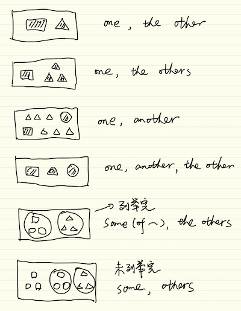

# Unit 4 - 代名词

(视频第 5 集)

代名词的作用：代替名词，避免重复。

代名词的几大类别：

1. 与人相关的代名词
   1. 人称代名词
   1. 所有代名词
   1. 反身代名词
1. 指示代名词
1. 不定代名词

## 人称代名词

人称     |  主格 (单 / 复)      |  受格 (宾格)            |  所有格
--------|---------------------|-----------------------|-----------------------
第一人称  | I / we              |  me / us              | my / our
第二人称  | you / you           |  you / you            | your / your
第三人称  | he, she, it / they  |  him, her, it / them  | his, her, its / their

什么是格，格是一种表现。不同的场合有不同的表现。

- 主格：表现为主语
- 受格：表现为受语

### 主格，所有格，受格的用法

- 主格 (主词) + 动词
  - **He likes** sports.

- 所有格 + 名词
  - **His friends** are over there.

- 一般动词 (动作) + 受格 (接受者) / 介系词 + 受格
  - The girl **loves him** very much.
  - I play **with him**.

那 be 动词呢，be 动词不是表示动作，而是表示状态。

be 动词原来的用法是：be 动词 + 主格，但逐渐不太遵守了。

示例：有人敲门，你会问 "Who is it?"，(不用 "who are you?"，因为并没有看到对方)，如果遵从严格语法，对方应该回答 "It is I"，但现代人都习惯说成 "It is me"。(这就是标准和实现的区别啊)

### 其它用法

#### it 的用法

it 除了作为人称代词代替第三人称，还可以代替很多。

it 可表示天气、时间、距离... 等等。(并不是形式主语，是真正的主语。)

- It rains a lots in Taipei in Spring.

  台北的春天经常下雨。It 表天气，但是不翻译出来。

- It was 2 o'clock when he came back home.
- It is 5 kilometers from here to the airport.

it 可表示某一状况，多半是说话人和听话人都能了解的特定状况。

- A: who knocked at the door?

  B: I thought **it** was Jack.

- It's all up to you. 一切由你来决定。

- I like it here.

  我喜欢这里。注意 "I like here" 是错误的表述。here 是地点副词。

- I don't feel like it. 我不想。

it 可当假主语，代替一件事。这才是形式主语，真正的主语在后面。放在后面的真正的主语有三种：

1. to + 动词原形构成的动词不定式引导的从句
1. doing
1. that 从句

为什么要这么做，因为上面这三种主语一般很长，直接当主语容易把整个句子搞得头重脚轻。主语应该是很短小的，所以用 it 来当假主语。

在中文中，表面上看，是可以直接用动词当主语的，比如 "做很难，说很容易"，但实际说是提 "做 - 这件事，很难，说 - 这件事，很容易"，在日语中，如果想实现类似的表述，想用动词当主语，是要在动词后面加上一个 "こと"，把它转成名词性质。

而在英语中，而是用 to + 动词原形，或 doing 形式，把动词转换成名词性质，然后充当名词性质的句子成分，比如主语、受语。

- It is difficult **to learn Spanish**.
- It's no use **telling him about it**.
- It's important **that you should tell the truth**.

  that 是连接词，连接两个主谓结构。

#### we / you / they 的特殊用法

只是代表说话的方向，并不是真的指我们，你们，他们。

- We has a heave rain yesterday. 昨天下了一场大雨。
- You don't see many Chinese there. 在那里看不到很多中国人。
- They speak English in Canada. 加拿大说英语。

## 所有代名词

所有代名词 = 所有格 + 名词。

人称     |  所有格 (单 / 复)         |  所有代名词
--------|-------------------------|--------------------------
第一人称  |  my / our               |  mine / ours
第二人称  |  your / your            |  yours / yours
第三人称  |  his, her, its / their  |  his, hers, its / theirs

用法：

- Your house is bigger than mine.
- My bicycles are here and his are there.

### 伴随双重所有格

在英语中，冠词和所有格，指示形容词 (this, that) 和不定形容词 (one, many, some)，不能同时放在名词前。

比如：我的一位老朋友。"我的" 是所有格，"一位" 冠词或不定形容词，"老" 是普通形容词。根据上面的规则，你不能翻译成 "My an old friend"。

那怎么办呢，双重所有格呗。

- I met one of my old friends on way home.
- I met an old friend of mine on way home.

mine 指代 my firends。

### 名词的所有代名词 = 所有格

- My dog is black, and Jason's is white.

## 反身代名词

反身：照镜子，看到自己，反射过来的身影。

反身代词的形成：

- 第一、二人称，单数：所有格 + self，复数：所有格 + selves
- 第三人称，单数：受格 + self，复数：受格 + selves

self：自己；selfish：自私。

反身代词没有主格。不会作为主词存在，因为只有当主词和受词对象相同时，才会使用反身代词充当受词。

人称     |  单数                       | 复数
--------|----------------------------|-----------
第一人称  |  myself                    | ourselves
第二人称  |  yourself                  | yourselves
第三人称  |  himself, herself, itself  | themselves

用法：主词和受词对象相同时。

- You always talk to yourself.
- The little girl hurt herself.
- He can do it by himself.
- I saw the singer himself.

反身代名词不能当主词。

- He himself can do it. (强调句)

## 指示代名词

指示人或事物的代名词。

- this (these) / that (thoes)
- so
- such
- same

### this / that

一般用法：用于人或事物，离说话者近用 this，距离远者用 that。

- This is my mask, that's Mary's.

(视频第 6 集)

代替用法：代替叙述过的事物，只有 that / those，而且后面必须要有修饰语。

- The weather **in Taipei** is cooler than **that in Kaohsing**.

  that 代替天气，不是 "那个"，而且后面一定要有修饰语，比如这里是 "in Kaohsing"。

noun + 修饰语 (比如 in Taipei)，补充说明。

### so

so：作为动词的受词或补语，指前面出现过的字或句子。

补语：对主词或受词，表语的补充说明。比如，"我是英语老师，谢孟媛"，"谢孟媛" 是对 "我" 的进一步说明。注意，它不是宾语，它并不是动作的对象。

"He make her happy"，这里 "happy" 是对受词的补充说明。

注意补语和状语的区别，状语我理解是对动词的进一步说明，表明动作的时间，地点，方式。

- He went to Beijing **yesterday**.
- He went to Beijing **from Shanghai**.
- He goes to Beijing **by airplane**.
- He leaves Beijing **sadly**.

充当补语的，可以是名词、形容词等；充当状语的，可以是副词、介系词+名词等。

so 的使用例句：

- A: Will it be fine tomorrow?

  B: I hope so.

  = I hope that it will be fine tomorrow.

  that 在这里是连接词，当一个句子有超过一个主语和谓语的时候，需要连接词。

- Do you still feel sick? If so, you must see the doctor.

- Nancy can play the violin, and so can I.

  so can I = I can, too.

  can 是助动词，后面用动词原形。

- She is smart, so she is. 她确实如此。(强调)

  She is smart, so is he. 他也是。

### such

"那样的事物或人"，可当代名词，形容词，可修饰单复数、不可数。

- They will plant flowers, **such as** roses, sunflowers.
- I don't know such a man.

  such (a/an) (+ 形容词) + n. such 也是 adj.

  - such a beautiful girl
  - such a cute boy

- Have you tasted any such food before?

  food，不可数。

  - any，用于疑问句
  - some，用于一般句

  such 前加接 all / other / another / any / few / every / no 等。

### same

一般前面需要加 the，the same，指代相同的事物。

- A: Can I have a cup of coffee, please.

  B: Give me the same, please.

"The same ... as ..."

- He uses the same typewriter as I do.

## 不定代名词

- 不特定的人或物
- 非一定数量的代名词

不定代名词有 adj 作用：

- Some of the boys like English.

  Some 是主词，是代名词，of the boys 是限定。有限定。

- Some boys like Englis.

  boys 是主词，some 是不定代名词，有 adj 作用。无限定。

哪些词后面可以直接跟名词：

- 冠词
- 所有格
- 形容词

(所以，不是所有跟在名词前的都是形容词啊。)

(视频第 7 集，继续代名词)

### one / ones

- one = a/an + 单数名词，指不特定的人或物
- ones，指不特定的人或物复数

例：

- I have lost my watch and I have to buy one. (one 没有特特定品牌或特征，代替 a watch)
- I like small cars better than large ones. (ones 代替 cars)

- one = a/an + 单数名词
- it = the + 单数名词 (限定)

例：

- Here are some apples, take one.
- I bought a good camera, I'll lend it to you.

### both / all

- both，两者都，用于 2 个人或 2 个物
- all，全部都，数量为 3 或 3 个以上的人或物，也可以代表不可数名词，如 all water，all money

在句子中的位置：

- be 动词和助动词之后，一般动词之前 (搞反了?)
- 定冠词 (the)，所有和，数词，形容词之前，如 all my books

例：

- Both (of) her children went to New York.
- I have read both these papers.
- All (of) my money was stolen.
- You may take all these toys.
- You may take them all.

**注意**，both，all 出现在否定句中，表示 "部分否定"，表示 "并非都"。

- I don't know both of her parents. 我并非都认识她的父母。
- Not all of them come from England. 他们并非全部都是来自 England.

both 的全部否定应该用 neither，all 的全部否定应该用 none。表示 "全部都不"，neither / none 本身已经表示否定，所以句子中不需要其它的否定词。

- I know neither of her parents. 她的父母我全部都不认识。
- None of them come from England. 他们全部都不来自 England。

### either / neither

- either，两者之中无论哪一个都可以，但是只能选其一，本身是肯定。
- neither，both 的否定，表示 "两者都不"，全部否定，本身为否定，不可和 not 同时出现。

例：

- Do you know either of the visitors? 你认识这两个观光客中的一个吗?
- I don't like both hats. 我并非都不喜欢这两顶帽子。(部分否定)
- I like neither of the hats. 我两顶帽子都不喜欢。(全部否定)

**否定字**

- neither = not either
- never = not ever

本身含 not，称为否定字，类似的还有 nothing，seldom ...

**either / neither 也有副词用法 (也不)**

Bill didn't come to my party, and

- ken didn't either.
- neither did ken.

### some / any

一般而言，some 用于肯定，any 用于否定、疑问及条件句 (if)，可代替可数和不可数。

- Some of the boys were late.
- Some of my money was stolen from my purse.
- Please lend me some money if you have any.
- Do you have any magzine to read?

**some 可用于表示 "请求，邀请" 的问句**

- Will you give me some help?
- Would you like some coffee?
- How about some tea?

### other / the other / others / the others / another

- other，表其它人或物，只作为形容词使用，修饰单数
- the other，代名词，表示特定的另一个
- others，other 的复数，代名词，不特定?
- the others，代名词，指代复数，特定?
- another = an + other，表不特定的另一个人或事物，无复数

例：

- I have two students, **one** is short, **the other** is tall.

- I have three flowers,
  - **one** is red, **the others** are yellow.
  - **one** is red, **another** is yellow, **the other** is pink.

- I don't like this one, show me
  - another. (数目为 3 或以上)
  - the other. (数目为 2)

- Some of **the** boys are here, but where are **the** others? (前面有限定词，后面也要有限定词)
- Some people said yes and others said no. (前面没有限定，后面也没有限定)

归纳：

其它：

- none，可数，不可数皆可
- several，可数
- most，可数，不可数皆可

例：

- None of the telephones is/are working. (none 作主词，谓语用单数复数皆可)
- Several of my friends attended the meeting.
- Most of it is there.
- Most of the people know it.

most 还可以作为作为形容词的最高级形式，前面要加 the。

- Who get the most New Year's cards?
- She is the most beautiful gril that I have ever seen.
