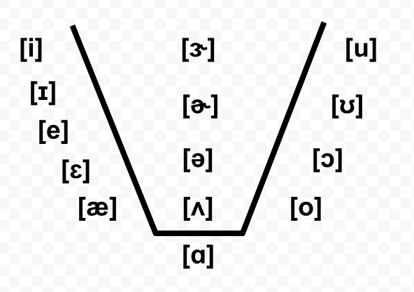

# 美式英语音标与发音视频教程笔记

## 序

在网上无意中看到[谢孟媛老师的这个英语发音的视频教程](https://www.youtube.com/playlist?list=PLaYqF7AnyNPd86-BJip5ldg6vw4lcZzxx)，看了一集后觉得讲得非常好，鉴于自己蹩脚的发音，于是决定跟着这个教程重新学习一遍英语发音，获益良多，也解决了以前的很多关于发音的疑惑，推荐指数五颗星。

以下是本教程的笔记，写得比较随意，也不见得完全准确，仅供参考。

由于谢老师是台湾人，视频教程中使用的一些专业术语与大陆使用的稍有不同，比如：

台湾 | 大陆
----|----
单字 | 单词
子音 | 辅音
母音 | 元音

为了与教程保持一致性，笔记中也使用了教程中使用的术语。另外，此教程使用的是 KK 音标，虽然与大陆教学使用的国际音标不完全相同，但我个人觉得对于发音学习没有很大的影响。

另外，这个教程中的发音为美式发音，与我们教学中学习的英式发音也有所不同，从 [这个 YouTube 视频](https://www.youtube.com/watch?v=XivgozCX9_U) 了解它们的不同。

----

## KK 音标汇总

音标拷贝自 <http://ipa.typeit.org/full/>。

    单母音：
    i  ɪ  e  ɛ  æ
    ɑ  o  ɔ  ʊ  u
    ʌ  ə  ɚ  ɝ

    双母音：
    au  aɪ  ɔɪ

    无声子音：p  t  k  f  s  θ  ʃ  tʃ  h
    有声子音：b  d  g  v  z  ð  ʒ  dʒ     m  n  ŋ  l  r  w  j

----

## Unit 1 - KK 音标

母音与子音。母音 (维基上的解释：母音是在发音过程中由气流通过口腔而不受阻碍发出的音。)，可以单独存在，除了 `[ə]` 和 `[ɚ]` 发轻声外，其余母音在单独发音时都念四声重音。`[ə]` 和 `[ɚ]` 不会出现在重音节中，所以只读轻音。

`[ə]`， 称为懒人音。举例：`[ə'bɔrd]` - a'board。

`[ɚ]`，舌头稍微翘一下，类似翘舌音。举例：`['sɪstɚ]` - sister，前面的 `i` 重读，而后面的 `er` 轻读，所以发轻音 `ɚ`，如果重音标在后面，那就不会发轻音的 `ɚ`，而是发重音的 `ɝ`，变成 `[sɪs'tɝ]`。

元音与嘴形分布图：

中间的开口表示人的嘴巴。由上到下，越上面，张口越大，表示嘴角越大，同时嘴张得越小 (你想想，嘴角越大，是不是嘴巴闭得越紧，因此嘴张得越小)，越往下，嘴张得越大，而嘴角就越小。

从 `[i]` 到 `[ɑ]`，嘴形逐渐变大。前者嘴形是最扁的，嘴角是最大的，而后者，嘴形是张得最大的，而嘴角是最小的。

### 1. `[i]` -> `[æ]`

- `[i]`：紧张音，嘴角更大，嘴形小。
- `[ɪ]`：放松音，嘴角更小，嘴形大一点。

两者都是短音 (似乎在 KK 音标中，并没有长音的概念)。

- `[æ]`：蝴蝶音。

`[e]` -> `[ɛ]` -> `[æ]`，嘴巴越张越大，`[æ]` 比 `[ɛ]` 嘴巴张更大，舌头更下压。(这两者发音差不多，为什么它们要区分到这么细的程度呢，想想中文的 z/c/s, zh/ch/sh, in 和 ing 等吧)。

例子：snake - `[snek]`，snack - `[snæk]`

### 2. `[ɑ]` -> `[u]`

从 `[ɑ]` 到 `[u]`，是嘴形收缩的过程。

- `[ɑ]`：发音`啊`，嘴巴张最大，张很大
- `[o]`：发音`欧`，收缩间，整个发音过程的口型变化从 `[ɑ]` 到 `[u]`
- `[ɔ]`：发音`哦`
- `[ʊ]`：放松音，不用嘟嘴巴，放松
- `[u]`：紧张音，发音时把嘴巴嘟起来，紧张 (相比紧张音，写法上多有个小尾巴，余音绕梁)

### 3. `[ʌ]`  `[ə]`  `[ɚ]`  `[ɝ]`

- `[ʌ]`：倒 v 音，发短促的 "啊" 音，嘴形比 `[ɑ]` 小，介于 `[ɑ]` 和 `[ə]` 之间
- `[ə]`：轻声，不翘舌，懒人音，饿饿的
- `[ɚ]`：轻声，翘舌，打了 2 个蝴蝶结
- `[ɝ]`：重声，翘舌，打了 3 个蝴蝶结

`[ɚ]` 与 `[ɝ]` 翘舌的区别：翘舌就是发音时舌头稍微往上弹。但前者发音时，舌头一开始是不翘的，中间动态地往上弹一下，而后者发音前就把舌头弹起，并在发音过程中一直保持。举例：'sister - `['sɪstɚ]`，bird - `[bɝd]`

bird - `[bɝd]`，因为只有一个音节，所以肯定是重音，所以这里肯定不能是发 `[ɚ]` 音，所以 `[ɚ]` 只会出现在多音节里的轻读部分，也肯定是不会发音成 `[bəd]`，因为 `[ə]` 也是轻读。(!!! 所以我的发音是多么的烂，以前我一直就是念成 `[bəd]`，简直是大错特错啊)。

bird：

- `[bəd]` x
- `[bɚd]` x
- `[bɝd]` v

a dog / a cat：`[ə dɔg]` / `[ə kæt]`，而不是 `[ɚ dɔg]` / `[ɚ kæt]`

英语发音是很圆融的，请记住这个特点。

### 4. 双母音：`[au]`  `[aɪ]`  `[ɔɪ]`

- `[au]`：发三声的 "袄"
- `[aɪ]`：发 "爱"
- `[ɔɪ]`：boy

(只有三个双母音？有点少啊)

### 5. 母音发音练习

1. `[i]` / `[ɪ]`
   - beater / bitter
   - reach / rich
   - greed / grid

   (我觉得这个 KK 音标中的 `[i]` 就是以前我们学习的 DJ 音标中的长元音 `[i:]`，`[ɪ]` 就是短元音 `[i]`。)

1. `[e]` / `[ɛ]`
   - waste / west
   - date / debt (b 和 t 在一起，b 不发音, `[dɛt]`，而不是 `[dɛbt]`)
   - mate / met

1. `[e]` / `[æ]`
   - maid / mad
   - lake / lack
   - snake / snack

   a + 子音 + e，e 不发音，a 发 `[e]`。

1. `[o]` / `[ɔ]`
   - low / law
   - coat / caught (`gh` 放在单字中间不发音)
   - boat / bought

1. `[ɪ]` / `[ɛ]`
   - sit / set
   - tin / ten
   - listen / lesson (listen 中的 t 不发音)

1. `[ɑ]` / `[ʌ]`
   - not / nut
   - sock / suck
   - collar / color

   (震惊了，一直以为 not/sock/colloar 这里的 o 是发 `[ɔ]` 的音，原来都是发 `[ɑ]`，而且查了字典，这是真的！原因如上文所说，这是美式发音与英式发音的区别)

自我总结：

1. 从发 `[ɛ]` 和 `[æ]` 音的单词来看，它们各自会搭配不同的辅音字母
   
   - `[ɛ]` - e : west, debt, met, set, ten, bed，嘴形张得不大
   - `[æ]` - a : mad, lack, snack，嘴形张得大。实际上，也只有字母 a 会发 `[æ]` 这个音，a 专属。

1. `[ɚ]` 与 `[ɝ]` 在单字中对应的发音字母后一般都带 r 字母，如 sister，bird。

### 6. 子音

子音分为有声子音和无声子音，子音都念轻声。

    无声子音：p  t  k  f  s  θ  ʃ  tʃ  h
    有声子音：b  d  g  v  z  ð  ʒ  dʒ     m  n  ŋ  l  r  w  j

- 无声子音：有气音送出来，发出来的是气音，只有嘴巴动，喉咙不用动。
- 有声子音：有声音送出来，发出来的是声音，会震动到喉咙，麻麻的。

无声子音有 9 个，有声子音有 15 个，其中它们的前 8 个是有一一对应关系的，如上表所示。这 8 个一一对应的子音，它们的无声与有声，发音时嘴形相同，但一个有气，一个有声。(这让我想起了日语中的送气与不送气音，ka -> 类 ga， ta -> 类 da，pa -> 类 ba。)

(另外，作为一些比较，日语中的清音一部分属于无声子音，`k s t h`，一部分属于有声子音，`n m y l w`，半浊音 `p` 也属于无声子音，而浊音 `g z d b` 则全部属于有声子音。)
   
(spark [spark]，实际发音 [sbark]；stark [stark] 实际发音 [sdark]；skill [skil] 实际发音 [sgil]；p->b，t->d，k->g，与日语中的清音浊化很相似)

1. `[p]` / `[b]`

   - 发 [p] 时，摸喉咙，喉咙是没有反应的，但嘴巴发出的气很重；
   - 发 [b] 时，喉咙有震动，不送气，或轻微的气流。

1. `[f]` / `[v]`

   - 上牙咬住下嘴唇，轻轻发音
   - [f]：F [ɛf]
   - [v]：five，(中文里没有这个音)

1. `[s]` / `[z]`
  
   - 舌头抵在上下牙齿中间后面
   - [s] 类中文 "丝"，[z] 类中文 "滋"

1. `[θ]` / `[ð]`

   - 咬舌音 (即发音时要咬住舌头)，上下牙齿含/咬住舌尖部分，然后发别发 [s] 和 [z] 的音，就能得到 [θ] 和 [ð]
   - [θ]：thank you!
   - [ð]：father

1. `[ʃ]` / `[ʒ]`

   - [ʃ]：类似中文发音 "嘘~~~" (把食指竖在嘴巴中间，让别人安静)，但嘴巴不用嘟起来，嘴巴没那么圆。
   - [ʒ]：保持 [ʃ] 的嘴型发音，然后用喉咙发音，最后发出的音类似中文的 "芋~~~"，一声的 "yu"。
   - [ʃ]：she [ʃi]

1. `[tʃ]` / `[dʒ]`

   - [tʃ]：发音类似中文的 "去"，四声 "qu"。
   - [dʒ]：发音类似中文的 "桔"，四声 "ju"。

1. `[h]`

   - 轻声有 "he"，呵，像叹气一样。无声子音，只有气流，没有声音，喉咙不动，很省力。

剩下的有声子音：

1. `[m]` / `[n]` / `[ŋ]`

   - 这三个称为 "鼻音"，用鼻子发音，喉咙要动。

   - [m]：嘴巴是闭紧的。有两种发音：
      - 母音前：mate，发音类似中文 "么" ("me")，这个音在汉语里有
      - 母音后：come，就发 [m]，这个音在汉语里没有，但台语里有

   - [n]：和 [m] 相比，[n] 不用闭嘴，而是要张嘴，记住同时要用鼻子发音，舌尖轻轻抵在上牙齿后面。
      - 母音前：nut，not，发音类似中文 "呢" ("ne")
      - 母音后：can，就发 [n]
   
   - [ŋ]：长腿鼻音，鼻音最重。东方人一般不好发这个音，因为要鼻子很高的人才好发。做辅助，把舌尖抵在下排牙齿后面，张开嘴，用鼻子发音，念 [n] 的音，就成了 [ŋ]。

   - [m] -> [n] -> [ŋ]，鼻音越来越重。

1. `[l]`

   - 母音前：发音类似中文的 "了" ("le")
   - 母音后：发音介于 [ə] 和 [o] 之间，轻微，快速带过，舌尖抵在上排牙齿后。很微妙，懂得这个意思就行。
   - girl [gɝl]，想象一下与 gir [gɝ] 的对比，没有 [l] 发音是怎样的
   - ball [bɔl]

1. `[r]`

   - 母音前：类似中文发音 "惹" ("re")
   - 母音后：类惟中文发音 "儿" ("er") / "饿" ("e")
   - R [ar]

1. `[w]`
  
   - 母音 [ʊ] 的轻声化

1. `[j]`

   - 母音 [ɪ] 的轻声化

易混淆的子音：

1. `[s]` / `[θ]`

   - pass / path
   - sink / think
   - sum / thumb `[θʌm]` (b 不发音)

1. `[z]` / `[ð]`

   - size / scythe
   - closed / clothed
   - bays / bathe

1. `[l]` / `[r]`

   - [r] 相比 [l] 多一点卷舌音
   - lead / read
   - flea / free
   - cloud / crowd

1. `[s]` / `[ʃ]`

   - sip / ship
   - seat / sheet
   - see / she

----

## Unit 2 - 拼音练习，发音篇

拼音原则：子音 + 母音 (后母接前子，后面的母音接前面的子音)

### 1. `[i]`

we see three bunnies in the field。

we [wi]，[w] 发轻音，[i] 发重音，轻音 + 重音，最后发重音。只有一个母音的单字，都读四声重音。(多音节里还有一声重音)。

see [si]

three [θ ri]

- 根据后母接前子的规则，这里 [i] 跟在 [r] 后面，[ri] 组成一个整体，因此 r 发 母音前 音，发 "惹"(re) 音，而不是 "儿"(er) 音
- 因此这里 ree 发成类似中文 "蕊"(rui) 音，而不是 "历"(ri) 音 (??)
- 剩下的 [θ] 没有母音照顾它，只好单独发音

bunny ['bʌni]

- ' 是重音符号，一个单字里有多个母音时，只能有一个重读，其它轻读
- 英语是轻重音，或者说强弱音，只有 2 种音调，不像中文有四五种
- 在多音节中，重音节不念四声，念一声，后面的轻音节念下降音(四声轻声)

field [fil d]

- [l] 在母音后，发 母音后 音，跟屁虫
- [d] 单独发音

We see three bunnies in the field。

当这些单字组成句子后，谁重读谁轻读又不一样了。在句子中，要强调哪个单字，就重读谁，要根据语境来。

句子中的 "the" 属于非机能语。

- 机能语：有中文意思，一定要翻译出来的。
- 非机能语：有中文意思，但不翻译出来也可以，一般是介词，冠词，一般不重读，除非你要强调它。

I like a dog。"a" 是非机能语。我喜欢狗 (而不是 我喜欢一只狗)。

"in the field"，在田野上 (而不是 在这片田野上)，"in the" 轻读。

听力，不可能每一个单字都能听得很清楚，把重音的那些单字听清楚，就能大致明白一整个句子大致讲什么。

### 2. `[ɪ]`

放松音。

Tim grilled six fish。

Tim [tɪ m]：音节的组合就是有一定规律的，你看这里为什么不发 [i] 呢，因为如果如 [i]，[tim] 发起来会很别扭，很累，所以 [i] 和 [m] 就不能组合在一起，而 [ɪ] 和 [m] 可以。(?? 那么 team 呢)

grill [g ril]：[l] 跟屁虫，发音介于 [ə] 和 [o] 之间。把这整个发音圆融化，让嘴巴尽可能轻松。

grill-ed [-d]：过去式，后面的 -ed 怎么发音，因为 grill 最后的 l 是发有声，所以 -ed 也发有声的 [d]，在词尾轻轻读过。

six [sɪ ks]：[ks] 无声子音，尽可能轻轻读过去。

fish [fɪʃ]

### 3. `[e]`

May baked eight cakes。

May [me]

bake [bek]

bak-ed [bek t]：-ed，由于前面的 [k] 是无声子音，因此这里 -ed 也要发无声子音，念 [d] 对应的无声子音 [t]，轻轻读过。

eight [et]：中间的 "gh" 不发音

cake [kek]

cakes [kek s]：复数 s，同上面 -ed 一样的道理，由于前面的 [k] 是无声子音，因此 s 发无声子音 [s]

所以，综上总结就是 (?，并不确定)：动词过去式，名词复数的尾缀的发音取决于前面的发音。无声后发无声，有声后发有声。

### 4. `[ɛ]`

Ted helped them sell seven eggs。

Ted [tɛd]

help [hɛlp]

helped [hɛlp t]：如上面的规则所言，由于前面的 [p] 是无声子音，所以这里 -ed 尾缀发无声的 [t]，轻轻快速读过。

them [ðɛm]："th" 90% 的情况下都发 [θ] 或 [ð]

sell [sɛl]

seven ['sɛ vən]：['sɛ] 发一声重音，[vən] 懒人音，发四声轻音

egg [ɛg]

eggs [ɛgz]：如上面的规则所言，由于前面的 [g] 是有声子音，所以这里的 -s 尾缀发有声的 [z]。

### 5. `[æ]`

----

## Unit 3

待补。

----

## Unit 4 - 重音练习

此部分内容在第 20 - 21 集。

待补。

----

## Unit 5 - 音的变化

此部分内容在第 22 集。

### 1. 子音 + 母音

前字字尾的子音和后字字首的母音，产生连读。例如：

- give up -> e 不发音，v 和 u 连读，最后发音 [gɪ vʌ p]
- take out -> e 不发音，k 和 ou 连读，同时 [k] 实际发 [g]
- turn off -> n 和 o 连读
- Take it easy -> Take 的 e 不发音，k 和 it 的 i 连读，it 的 t 和 easy 的 ea 连读，最后发音 [te kɪ ti zi]

### 2. 子音 + 子音

分 2 种情况：

1. 前字字尾的子音和后字字首的子音相同，前子音省略；
1. 子音 [p] [b] [t] [d] [k] [g] [f] [v] 要轻音化 (即不用发那么清晰，像是含在嘴里一样)。

例如：

- sit down -> sit 的 t 省略发音
- credit card -> credit 的 t 省略发音
- 'hot dog -> hot 的 t 省略发音，注意这里，hot 并不是形容词，这是一个复合词，所以重音在前面的 hot
- I was so happy. -> was 的 s 省略
- He needs a lot of monye. -> needs 和 a 连读，lot 和 of 连读，of 的 f 轻音化，最后发音 [hi ni dzə lɑ tə(v) mʌni]

- I have **got** to go. => I have gotta go.
  1. 美语中习惯用 `have got to` 替代 `have to`，使读起来更圆融
  1. have 的 h 在句中不发音
  1. `got to` 省略第一个 t，to 发 [tɑ]，因为最终变成 gotta
  1. 最后的发音 [ai æv gɔtɑ go]

- Do you want to dance? => Do wanna dance?
  1. Do 和 you 连读
  1. `want to`，省略第一个 t，第二个 t 轻音化，o 发 [ə]

英语发音两大原则：

1. 尽量「懒惰」，能省则省；
1. 放轻松

### 3. 母音 + 母音

前字字尾的母音和后字字首的母音连读，会多出 [w] 和 [j] 的发音。例如：

- Do I? -> [d**w**uai]
- You're so honest.
- He is a boy. -> He 和 is 间多出一个 [j] 的发音 (不过我没怎么感受到)

### 4. T/D/S/Z + Y

[t][d][s][z] 结尾的字，接上 y 开头的字，产生以下音变：

#### 1. [t] + y -> [tʃ]

例如：

- Can't you do it? -> t 和 y 连读，发音 [tʃ]，do 和 it 连读，母音加母音，多出一个 [j] 发音
- I'll let you know. -> let 和 you 连读
- Is tha**t y**our car? / No, no**t y**et. -> 另外，Is 的 s 发 [z]，that 的 th 发 [ð]，发音相近，可以省略前面的 [z]

#### 2. [d] + y -> [dʒ]

例如：

- Di**d y**ou love me? -> 另外，一般疑问句，最后是升调
- Could you tell me?
- Where did you buy it? -> 另外，特殊疑问句，不用升调，buy 的 y 发 [aɪ]，it 的 i 发 [ɪ]，连读时可以只发一个 [ɪ]。

#### 3. [s] + y -> [ʃ]

例如：

- God bless you.
- I miss you.
- Can you dress yourself?

#### 4. [z] + y -> [ʒ]

一般也是由 s 发 [z]。例如：

- How was your vacation? -> was 的 s 发 [z]，和后面的 your 连读发 [wɔ ʒɔ]
- He says you're good. -> says 和 you 连读，says 发 [sez]
- Where's your sister? -> where's 的 s 发 [z]

----

Done @ 2016.11.26
