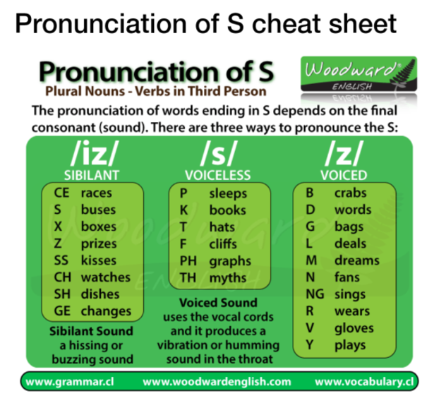
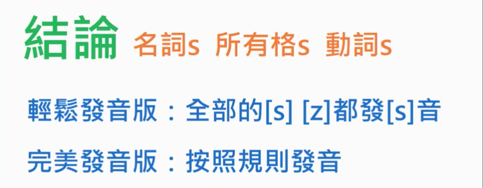

# 补充

1. 英式和美式发音的不同
1. 一些发音技巧
1. 单数名词 + s / es 变复数的发音
1. 第三人称单数，动词 + s / es 的发音
1. 动词过去式，动词 + d / ed 的发音

## 英式和美式发音的不同

从这个视频 - [5 Pronunciation Differences btw American and British English [Korean Billy]](https://www.youtube.com/watch?v=XivgozCX9_U) 了解它们的不同。最显示的区别在于，在英式发音中，o 发 [ɔ] 的地方，在美式发音中变成了 [ɑ]，我觉得从这个区别上能体会两种语言的一些特点，前者比较字正腔圆，很正式的感觉，后者比较 casual，夸张。

- box [bɔks] / [bɑks]
- clock [klɔk] / [klɑk]
- top [tɔp] / [tɑp]

另一个区别是 a 的发音，英式中常发 [ɑ]，则美式中发 [æ]。

- can't [kɑnt] / [kænt]
- ask [ɑsk] / [æsk]
- bath [bɑθ] / [bæθ]
- chance [tʃɑns] / [tʃæns]

## 一些发音技巧

- [Youtube - 麦克老师](https://www.youtube.com/playlist?list=PLNXW1mx0qgEfcsV3nk_wzpFEtUycD9rdc)

[f] [v] [w] 的区别。venus ['vinəs]，will [wɪl]。(之前还真没意识到 [v] 和 [w] 发音这么接近...)

- [f] / [v]：发音时上牙咬住下嘴唇内侧。前者无声，后者有声，震动声带。
- [w]：发 [w] 时嘴是张开的。

美国俗语 - bite my v, kiss my w。意思是说，发 [v] 时像咬，发 [w] 像接吻的动作 (嘴唇撅起)。有意思。

## 单数名词 + s / es 变复数的发音

- [Youtube - 3 Sounds of the Plural s in English s, z or ɪz](https://www.youtube.com/watch?v=GZdP0TqaykI)
- [Youtube - 英文名詞複數 s 的發音 #01](https://www.youtube.com/watch?v=UirGG4ohWKM)
- 知乎 - 英语名词复数结尾何时读 [s] 或者 [z]
  - [回答 1](https://www.zhihu.com/question/40647753/answer/87659389)
  - [回答 2](https://www.zhihu.com/question/40647753/answer/131123460)
- [英语名词复数变化及发音规则](https://www.hjenglish.com/new/p95953/)

一图胜千言 (图截自上面 [回答 2](https://www.zhihu.com/question/40647753/answer/131123460))：

- [s] --> 无声配无声
- [z] --> 有声配有声
- [ɪz] --> 字尾 [s] [z] 后发 [ɪz]

从这些资料来看，确实，只有无声子音后的 s 发 [s]，其余大部分情况都发 [z] 或 [ɪz]，为什么我一直有一种错觉，我以前念的时候大部分都是发 [s] 呢。

比如以下单词，根据理论，都是要发 [z] 的，我似乎都发成了 [s]

- windows ['wɪndo z]
- dogs
- fans [fæn z]
- boys
- photos

如果 fans 一直都是发 [fænz] 的话，人们为什么会把它音译成 "粉丝"?

以后多留意视频和身边的人是怎么发复数音的。

(根据理论重新纠正了以前的错误发音，感觉是比以前正常了...)

但是! 在上面的 [Youtube - 英文名詞複數 s 的發音 #01](https://www.youtube.com/watch?v=UirGG4ohWKM) 视频中，最后说到，全部发 [s] 也是可以的，居然是真的，汗...

有图有真相：

## 第三人称单数，动词 + s / es 的发音

第三人称单数的动词结尾也是加 s / es，所以变化和发音规则和单数名词变复数是几乎 (我感觉甚至可以说是完全吧) 一样的。

少数几个特例：

- have --> has
- be --> is

加 s / es 后导致原来的元音发生变化的例子：

- do [du] --> does [dʌz]
- say [se] --> says [sɛz]

(这几个特例都是最常用的啊，享有特权。)

## 动词过去式，动词 + d / ed 的发音

### 发音规则

d / ed 的发音规则其实和 s / es 的发音规则是类似的。

- 无声后发 [t]：liked，asked，pushed
- 有声后发 [d]：loved，called，joined，played
- [t] [d] 后发 [ɪd]：hated，started，wanted，needed

### 变化规则

规则动词的过去式由 "动词原形 + ed" 构成，具体变化有：

1. 直接在词尾加 ed。如：wanted，worked，needed，cleaned
1. 以不发音的 e 结尾的在词尾加 d。如：liked，lived，used，moved
1. 以一个元音字母加一个辅音字母结尾的重读闭音节动词，先双写结尾的辅音字母，再加 ed。如：stopped，tripped
4. 以辅音字母加 y 结尾的动词，先把 y 变成 i，再加 ed。如：studied，carried，hurried，married

不规则动词的过去式大体上归纳有以下六条记忆法：

1. 以 t 结尾的词，过去式与原形相同。如：put，let，cut，beat
1. 以 d 结尾的词，把 d 变成 t。如：built，lent，sent，spent
1. 以 n 结尾的词，在词后加 t。如：meant，burnt，learnt
1. 以 ow / aw 结尾的词，把 ow / aw 变成 ew。如：blow -> blew，draw -> drew，know -> knew，grow -> grew
1. 含有双写字母的词，将双写改为单写，在词尾加 t。如：keep -> kept，sleep -> slept，feel -> felt，smell -> smelt
1. 含有元音字母 o / i 的词，将 o / i 变成 a。如：sing -> sang，give -> gave，sit -> sat，drink -> drank

(感觉像是千方百计要把它们的结尾变成 t。)
