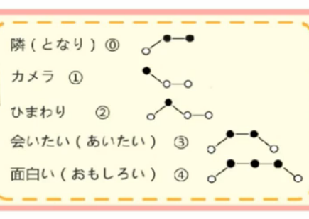
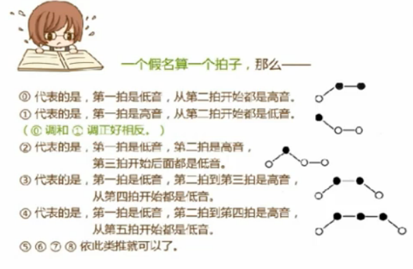

# 日语 - 五十音图

学习资料：[日语零基础：快乐玩转五十音](http://study.163.com/course/courseMain.htm?courseId=243001)

学习时间：2014/09/29

## 五十音图

    あ　い　う　え　お　　　　ア　イ　ウ　エ　オ
    か　き　く　け　こ　　　　カ　キ　ク　ケ　コ
    さ　し　す　せ　そ　　　　サ　シ　ス　セ　ソ
    た　ち　つ　て　と　　　　タ　チ　ツ　テ　ト
    な　に　ぬ　ね　の　　　　ナ　ニ　ヌ　ネ　ノ

    は　ひ　ふ　へ　ほ　　　　ハ　ヒ　フ　ヘ　ホ
    ま　み　む　め　も　　　　マ　ミ　ム　メ　モ
    や　　　ゆ　　　よ　　　　ヤ　　　ユ　　　ヨ
    ら　り　る　れ　ろ　　　　ラ　リ　ル　レ　ロ
    わ　　　　　　　を　　　　ワ　　　　　　　ヲ
    ん　　　　　　　　　　　　ン

如何正确记住行的顺序：

    a  ka sa ta na (最后三个，sa 再加一个 n，さんたな，念起来是不是很像"桑塔纳"。)
    ha ma ya ra wa (ha ma，蛤蟆...)

五十音的内容：

- 清音，浊音，半浊音，鼻浊音
- 送气音，不送气音
- 声调
- 长音，促音，拗音，拗长音
- 拨音

## 清音

### a 行

    あ い う え お
    ア イ ウ エ オ

如何记住 あ 行的片假名写法：

    エア (e a) 空气，来自于英文 air
    イ   来自于汉字 "伊" 的偏旁
    ウ   像屋顶
    オ   カラオケ，卡拉 OK

#### 安 --> あ ア

    愛 あい
    嵐 あらし            (a ra si) 暴风雨，一个偶象组合
    アニメ               (a ni me) 动漫，由英文 animation 而来
    愛 (あい) してる      (a i si te ru) 我爱你

#### 以 --> い / 伊 --> イ

    おみあい     (o mi a i) 相亲
    アイドル     (a i do ru) 偶象
    イケメン     (i ke me n) 帅哥
    あいたい     (a i ta i) 好想见你

#### 宇 --> う ウ

    海 うみ         (u mi)
    兔 うさぎ       (u sa gi)
    ウイルス        (u yi ru su) 病毒， 由英文 virus 而来
    うるさい        (u ru sa i) 好吵啦 ??

#### 衣 --> え / 江 --> エ

    円 えん                  (e n) 日元
    絵文字 えもじ             (e mo ji) 表情符号
    エアコン                 (e a ko n) 空调，由英文 aircon 而来
    帰りたい (かえりたい)      (ka e ri ta i) 好想回家

#### 於 --> お オ

    おもしろい      (o mo si ro i) 有趣的
    オタク         (o ta ku) 御宅族
    カラオケ       (ka ra o ke) 卡拉 ok
    おいしい       (o i si i) 好吃！

### ka 行

    か き く け こ
    カ キ ク ケ コ

如何记住这几个片假名的写法，尤其是 ク 和 ケ 还那么像。可以这样记。

- カ キ コ 的写法，和平假名相似，易记住。
- ク，上节学过 オタク，御宅族的意思。
- ケ，上节学过 カラオケ，卡拉 OK 的意思。

#### 加 --> か カ

    顔 (かお)            脸
    歌舞伎 (かぶき)       (ka bu gi 变音) 歌舞伎
    カメラ               照相机 (camera)
    かわいい             (ka wa i i) 卡哇伊，真可爱

#### 幾 --> き キ

    着物 (きもの)        (ki mo no) 和服
    天気 (てんき)        (te n gi 变音) 天气
    キス                (ki su) 吻 (kiss)
    すてき！             (su te gi 变音) 太棒了

日语中有 6 个平假名，有印刷体和手写体两种，き 就是其中一个。手写体一般用于写信。印刷体用于书藉，网络。我们能看到的一般都是印刷体。手写体的 き，上部和下部没有连在一起。

#### 久 --> く ク

    熊 (くま)           (ku ma) 熊
    記憶 (きおく)        (ki o ku) 记忆
    クラス              (ku ra su) 班级 (class)
    くるしい            (ku ru si i) 好难受

#### 計 --> け / 介 --> ヶ

    怪我 (けが)            (ke ga) 傷
    化け物 (ばけもの)       (ba ke mo no) 妖怪
    バスケ                 (ba su ke) 籃球 basket
    けち!                  (ke chi) 小氣鬼

#### 己 --> こ コ

    恋 (こい)           (ko i) 戀愛
    心 (こころ)         (ko ko ro) 心
    コツ               (ko tsu) 秘訣
    これは？            (ko re wa 變音) 這是什么？

日语中有**送气音**与**不送气音**之分。

- 位于词首，句首，送气音
- 位于词中，词尾，不送气音

- 送气音，辅音气流比较强烈，如 ka
- 不送气音，辅音气流微弱，如 ga

发音时，可以把手掌放在嘴前，感受一下气流。

日语语速较快，把演变过程中，逐渐慢慢地，把一些强辅音弱化，变成了不送气音。

日语中有三行假名，かたぱ，位于词首句首时，发原本的音，位于词中词尾时，变音为不送气音。这是一种自然而然的演变过程。

不送气音**不等于**浊音! (说是这么说，但实际真是的好难分辨啦...)

和英语发音联系想来看，有一些相似之处：

    无声子音：p  t  k  f  s  θ  ʃ  tʃ  h
    有声子音：b  d  g  v  z  ð  ʒ  dʒ     m  n  ŋ  l  r  w  j

    送气音   --> 无声子音 [k] [t] [p]
    不送气音 --> 有声子音 [g] [d] [b]

在英语中，同样存在发音时要将无声子音变成有声子音的情况：

    skill [skil] --> [sgil]
    stark [stɑk] --> [sdɑk]  /  star [stɑ] --> [sdɑ]
    spark [spɑk] --> [sbɑk]

### sa 行

    さ し す せ そ
    サ シ ス セ ソ

#### 散 --> さ サ

    桜 (さくら)          (sa ku ra) 樱花
    刺身 (さしみ)        (sa si mi) 生鱼片
    サイン              (sa i n) sign
    ださい              (da sa i) 好逊哦

#### 之 --> し シ (shi / si)

し 的罗马音是 shi 或 si，但 shi 更常用。发音像 "西"。

罗马音也用在日文输入法中用来输入日文。

    寿司 (すし)
    島 (しま)             (si ma)
    シルク                (si ru ku) 丝绸 silk
    知 (し) らない         (si ra na i) 不知道

#### 寸 --> す / 须 --> ス (su)

す，发音类似 "思"，或数字 4。す 属于 う 段，嘴巴要微微拢成 う 的样子。

    西瓜 (すいか)
    アイス                 冰激凌 ice
    バス                  (ba su) bus
    すごい                (si go i) 真历害

#### 世 --> せ セ

    世界 (せかい)
    偽物 (にせもの)        (ni se mo no) 仿冒品
    セリフ                (se ri fu) 台词
    幸 (しあわ) せ!        (si a wa se) 好幸福

#### 曾 --> そ ソ

so 的片假名如何记，取 so 平假名的手写体上半部分。

    空 (そら)             (so ra) 天空
    そば                  (so ba) 荞麦面、旁边
    ソロ                  (so ro) solo
    うそ!                 骗人，真的假的?

### ta 行

    た ち つ て と
    タ チ ツ テ ト

这节课的日文歌是灌篮高手，学会它!

一期一会 (いちごいちえ)：一期是一生的意思，一生只见一次。从茶道中而来。把每次茶道的会面都当作一生中只会进行一次来看待，精心准备。引申过来就是说要把每一分钟都当作生命中仅有的一次，要珍惜时间，珍惜生命。

注意，た 行是有不送气音的。

#### 太 --> た / 多 --> タ

    畳 (たたみ)          (ta ta mi) 榻榻米，就是凉席啦。后来日本人计算一个房子的面积也用榻榻米作单位来计算。
    たこ焼 (や)き        (ta ko ya ki) 章鱼小丸子
    タイプ               (ta i pu) type
    たいへん             (ta i he n) 够呛

#### 知 -->ち / 千 --> チ (chi)

发类似数字 7 的音，有两种罗马音写法，chi 更常见。

    ちび                (chi bi) 小不点。(樱桃 小丸子 中的 小丸子 就是 小不点 的意思)
    遅刻 (ちこく)        迟到
    キムチ              (ki mu chi) 泡菜

寒暄语：

    こんにちは           (你好，用于除早上晚上的其它时段)
    おはようございます    (早上好)
    こんばんは           (晚上好)
    おやすみなさい        (晚安)

#### 川 --> つ ツ (tsu / tu)

罗马音常写作 tsu，而不写作 tu。发音技巧，先发 "刺"，再变成 u。ツ 可以想成高兴的兴的上半部分来记。

    秘密 (ひみつ)       (hi mi tsu)
    翼 (つばさ)         (tsu ba sa) 翅膀
    ドイツ             (do i tsu) 德国??
    つまらない          (tsu ma ra na i) 无聊

#### 天 --> て テ

て 的使用率很高，由汉字 "天" 而来，发音也类似。天气 (天気　てんき)

    地下鉄 (ちかてつ)　   地铁 (集中了本行假名的三个假名，好例子)
    天使 (てんし)
    モテモテ            (mo te mo te) 抢手
    かすけて！           救命 ??

#### 止 --> と ト

    隣 (となり)             (to na ri) 邻居
    友達 (ともだち)          (to mo da chi) 朋友
    トマト                  (to ma to) tomato
    ありがとう。             (a ri ga do n) 多谢!

宫骑骏的电影，龙猫，这个名字是中国人取的，日文中全名是 隣 (となり) のトトロ，即 隔壁的 totoro。

日语的声调，以高低来区分。

规律：如果某个词的调是 x 调，那么 2-x 都是高音，其余是低音。

如果单词发音只有两个假名，那么 0 调和 2 调是一样的声调，那么区别在哪呢。区别在于它们后面加假名时，0 调不用变声调，2 调要降调。

看图：

### na 行

    な に ぬ ね の
    ナ 二 ヌ ネ ノ

这一行的假名最好记了。平假名和片假名基本都是来自相同的汉字，写法相近，有些连发音都相近呢。

#### 奈 --> な ナ

片假名可以看作是平假名的上半部分，或者是来自汉字的上左半部分。

    夏 (なつ)  0
    バナナ     1   (ba na na) banana
    ナンパ     0   (na n pa) 搭讪
    なるほど   0   (na ru ho do) 原来如此，そが

夏天的日本很热闹，最有名的是烟花大会。

    花火 (はなび)               (ha na bi) 烟花
    花火大会 (はなびたいかい)

全民穿浴衣上阵。

    浴衣 (ゆかた)

#### 仁 --> に / 二 --> 二

    兄 (あに)     1
    日本 (にほん)
    テニス        1  tenis
    なに？           什么?

#### 奴 --> ぬ ヌ

片假名可以看成是奴的右半部分。

    犬 (いぬ)        2  狗
    ぬくもり         0  (nu ku mo ri) 温和
    エヌ            1  北，名词
    盗 (ぬす) まれた     (nu su ma re ta) 被盗走了

#### 祢 --> ね ネ

片假名看作是 "祢" 的偏旁。

    猫 (ねこ)       1
    お金 (かね)     0  钱
    ネクタイ        1  领带
    お願 (ねが) い     求你了

#### 乃 --> の ノ

片假名看作是 "乃" 的那一撇。

    命 (いのち)             1  性命
    飲 (の)み物 (もの)          饮料
    ピアノ                     (pi a no) piano
    どこ行 (い)くの             (do ko i ku no) 去哪里？

认识假名和声调，生词也能正确发声。

### ha 行

    は ひ ふ へ ほ
    ハ ヒ フ ヘ ホ

有趣，这一行假名都是一种笑声。

- hahaha  哈哈大笑
- hihihi  奸笑
- huhuhu  用鼻子发出的笑声
- hehehe  傻笑
- hohoho  蜡笔小新的妈妈常发出的笑声

#### 波 --> は / 八 --> ハ

如果记不住 ha 的片假名，片假名不是长得很像 "八" 吧，所以可以用 "哈巴狗" 来记。

    春 (はる)       1  春天
    蜂蜜 (はちみつ)  0  蜂蜜
    ハワイ          1  夏威夷
    はじめまして        初次见面

#### 比 --> ひ ヒ

记忆法：捡到一个钱袋子 (平假名很像一个钱袋子嘛)，里面不仅有钱，还有一把瑞士军刀，即匕首，不敢大声笑出来，所以 hihihi 奸笑。

    ひげ            0  胡子
    ひまわり         2  向日葵
    ヒロイン         2  女主角，女英雄，heroine
    久 (ひさ) しぶり    (hi sa si bu ri)

#### 不 --> ふ フ

fu/hu，但是既不读 "扶"，也不能 "呼"。发音诀窃，先发 u 的音，再吐气。

hu 的平假名有手写体和印刷体两种。

    冬 (ふゆ)        2  冬天
    お風呂 (おふろ)   2  o fu ro (日本的泡澡文化)
    ナイフ           1  小刀
    振 (ふ) られた      fu ra re ta 被甩了

#### 部 --> へ ヘ

平假名和片假名相象，到造字的后面阶段日本人是越来越懒了啊。

    部屋 (へや)   2  he ya 屋子
    下手 (へた)   2  不擅长
    ヘアスタイル   4  发型 hair style
    へこむな。        别泄气嘛。

#### 保 --> ほ ホ

    星 (ほし)         0  星星
    微笑み (ほほえみ)  0  微笑
    ホスト            1  男公关
    ほら〜               瞧~

は、へ做助词时会变音 (但在单词中还有发原来的音)

- は (ha) --> wa
- へ (he) --> e

### ma 行和 ya 行

    ま　み　む　め　も
    マ　ミ　ム　メ　モ

    や　　　ゆ　　　よ
    ヤ　　　ユ　　　ヨ

#### 末 --> ま / 万 --> マ

片假名可以想成是 "通" 的上半部分。

    名前 (なまえ)  0  名字
    わがまま       3  任性
    クリスマス     3  圣诞节
    マジで?          ma ji de 真的假的? (为何平假名片假名混用??)

#### 美 --> み / 三 -->ミ

如果记不住 (我其实记住了)，猫咪 (mi)，爱臭美，一爪子过去，留下三横。

    耳 (みみ)          0  耳朵
    おみくじ           0  神签
    ミス               1  错误
    見 (み) せて〜！       给我看看~

#### 牟 --> む ム

    息子 (むすこ)      0  儿子
    無理 (むり)        1  做不到
    アルバム           0  (a ru ba mu) 相册
    ムカつく！            真来气！(这也是平假片片假名混用??)

#### 女 --> め メ

片假名可以看作是 "女" 的右下部分。

    雨 (あめ)          1  雨
    娘 (むすめ)        0  女儿
    メガネ             1  眼镜 (me ga ne)
    珍 (めずら) しい。     真少见。真稀罕。   (a zu ra si i)

    息子 (むすこ)   儿子
    娘 (むすめ)　　女儿

#### 毛 --> も モ 

    もも           0  桃子
    気持 (きも) ち  0  心情
    リモコン        0  遥控器
    もしもし〜         喂?

#### 也 --> や ヤ

    休 (やす) み    0  休息、假日
    やばい          2  (ya ba i) 糟糕
    イヤリング       1  (i a ri n gu) 耳环
    おやすみなさい。     晚安。

#### 由 --> ゆ ユ

    梅雨 (つゆ)        0  梅雨
    雪 (ゆき)          0  雪
    コリ              0  百合
    夢 (ゆめ) みたい！     好像做梦一样

#### 与 --> よ ヨ

    夜 (よる)       1  夜晚
    花嫁 (はなよめ)  2  新娘
    ヨガ            1  瑜珈
    よし！             好!

### ra 行和 wa 行

(2014/10/12)

    ら　り　る　れ　ろ 
    ラ　リ　ル　レ　ロ

    わ　　　　　　　を
    ワ　　　　　　　ヲ　　　

    ん
    ン

#### 良 --> ら ラ

奈良 (なら)

    落書 (らくが) き  0  涂鸦
    体 (からだ)      0  身体
    ライブ           1  现场直播、演唱会

#### 利 --> り リ

发音也像 "利"。

    りんご        0  苹果
    終 (お) わり  0  结束
    リボン        1  丝带

#### 留 --> る / 流 --> ル

    留守 (るす)      1  外出 (なに?)
    蛍 (ほたる)      1  萤火虫
    リアル           1  真实的
    許 (ゆる) して！     原谅我！

#### 礼 --> れ レ

    歴史 (れきし)        0  历史
    照れ屋 (てれや)      2  腼腆的人
    レモン              1  柠檬
    頑張 (がんば) れ！      加油！

#### 呂 --> ろ ロ

我来咯，我走咯。

    色 (いろ)  2  颜色
    城 (しろ)  0  城堡
    ブログ     0  博客
    よろしく。     请多关照。

#### 和 --> わ ワ

发音和 "哇" 相似。ワ 仅存的一根头发都没有了，真的是要哇哇大叫了。

    わさび         1  芥茉
    指輪 (ゆびわ)   0  戒指
    ワイン         1  红酒
    わかりました。     我知道了。

#### 遠 --> を / 乎 --> ヲ

虽然是 o 的发音，但在输入时为了与 お 区分，要输成 wo。另外，在唱歌的时候经常发成 wo 的音。

を 没有相关单词，只在句中作为助词使用。

    ぎまを見ろ。      活该。

日语的结果：单词 + 助词 + 单词 + 助词 + 单词 ...

#### 无 --> ん / 尔 --> ン

    みかん           1  橘子
    温泉 (おんせん)   0  温泉
    カンニング        0  作弊
    全然 (ぜんぜん)。    完全没有。

### 浊音，半浊音，鼻浊音

(2014/10/15)

#### 浊音

が (ga)、ざ (za)、だ (da)、ば (ba) 四行。

    が　ぎ　ぐ　げ　ご
    ざ　じ　ず　ぜ　ぞ
    だ　ぢ　づ　で　ど
    ば　び　ぶ　べ　ぼ

读音：把 か さ た は/ぱ 四行的辅音由清音变成浊音。如果对应到英文里，就是由无声子音变成对应的有声子音。

    无声子音：[k] [s] [t] [p]
    有声子音：[g] [z] [d] [b]

上面 [p] 的发音实际是后面会讲到的半浊音。

写法：在 か さ た は 四行假名右上角加两个小点。

这几个浊音中有两对发音是一样的：

- じ (ji/zi) / ぢ (di)，都发 ji "鸡" 音。
- ず (zu)    / づ (du)，都发 zi "滋" 音。

但是前者 (即 za 行) 更常用。

#### 鼻浊音

只有 が 行一行。

    が　ぎ　ぐ　げ　ご

发鼻浊音时，先形成堵塞，放开鼻腔通路让有声气流先经鼻腔流出，随即再放开，使气流向口腔流出。

    ん + あ --> が
    ん + い --> ぎ
    ん + う --> ぐ
    ん + え --> げ
    ん + お --> ご

何时发鼻浊音?

1. が 行浊音，位于词首时，仍发原来的浊音，位于词中和词尾时，可读鼻浊音。
1. 年轻人很少使用鼻浊音。

#### 半浊音

只有 ぱ (pa) 行一行。

    ぱ　ぴ　ぷ　ぺ　ぽ

发音：辅音 p 加上 a 行音。把手心放在自己的嘴巴前面，能感叹到强烈气流。

### 送气音与不送气音

这个在上面已有讲述，这里再稍做总结。

か、た、ぱ 三行，位于词中词尾的时候会发生变音，变成发不送气音。[k] -> [g]，[t] -> [d]，[p] -> [b]。发成类似 が、だ、ば 浊音，但并不完全相同，浊音有用喉咙震动声带产生麻麻的感觉，但不送气音并没有。(...太理想化了)

    ばか  八嘎

提示：读不好不送气音的话，干脆就先别勉强读，免得记错单词拼写。

### 长音和促音

(2014/10/16)

前面学习了日语的声调，接下来学习节奏。日语的节奏：长音和短音。

#### 长音

日语中的音节分为长音节和短音节。根据音节长短不同，日语意思有时也会随之发生改变。

比如：

- ビル：大厦
- ビール：啤酒

长音：把短音的元音长度加长一倍。

短音 | 长音 | | 短音 | 长音
----|------|-|-----|----
あ  | ああ  | | か  | かあ
い  | いい  | | き  | きい
う  | うう  | | く  | くう
え  | えい  | | け  | けい
お  | おう  | | こ  | こう

写法与规则：

- あ 段假名后 + あ，例：おかあさん
- い 段假名后 + い，例：おにいさん
- う 段假名后 + う，例：くうき
- え 段假名后 + い，例：せんせい，也有特例，后面 + え，例：おねえさん
- お 段假名后 + う，例：おとうさん，也有特例，后面 + お，例：とおい
- 片假名外来语统一 + "ー"，例：クール

如何在输入法中输入片假名的长音：在日文输入法状态下，减键盘上的减号键。

#### 促音 っ ッ

小一号的 つ，但发音、意义、写法和作为平假名的 つ 是完全不同的。

发音：先堵住气流，形成一个短促的顿挫停顿一拍，然后放开堵塞，使气流冲出，接着再发后面的假名。

例：

    サッカー         足球
    きって           邮票
    きっさてん     0  咖啡馆
    ちょっとまって。   稍等一下。

如何在输入法中输入促音：双打促音后面假名的辅音。比如 "切手 (きって)"，在日文输入法状态下，输入 kitte 可以得到。

### 拗音

(2014/10/17)

拗音：除 い 段以外的 い 段假名 (き、し、ち、に、ひ、み、り、ぎ、じ、び、ぴ)，和复元音 や、ゆ、よ 拼合起来的音节。

写法：在假名后面写上小写的 や、ゆ、よ 就可以了。

    き + や --> きゃ
    ki + ya --> kya

    き + ゆ --> きゅ
    ki + yu --> kyu

    き + よ --> きょ
    ki + yo --> kyo

如何在输入法中输入拗音：输入拗音的罗马音即可，比如输入 kya 就可以得到 きゃ。

拗音表：略。

关于拗音，想想台湾腔的 "不要酱子嘛"，"你造吗"。

#### 拗长音

发长音的拗音，即拗长音。

写法：

    や + あ
    ゆ + う
    よ + う
    ヤユヨ + ー

例：

    じゃあね。    再见
    きょう       今天

### 总复习

(2014/10/18)

略。

罗马音 & 输入法篇：

1. 一些较特殊的罗马音，前者为推荐拼法
   - し  shi/si
   - ち  chi/ti
   - つ  tsu/tu
   - ふ  fu/hu
   - じ  ji/zi
   - ぢ  di/ji
   - づ  du/zu
1. を，输入 wo
1. ん，输入 nn
1. 在元音的罗马音前输入 l 或 x，可得到小号的对应的假名，比如输入 xa，可得到 ぁ，xi - ぃ，xu - ぅ，xe - ぇ，xo - ぉ。

视频到此就中断了，感觉并不完整。比如拨音就没讲到。

Done@2014/10/19。

---

五十音图算是学完了，接下来看新标日的视频。

今天在公交车上，听到一位母亲教小孩怎么念京味 (we) 的「味」，「就是这个味 (we)，不念作味 (wei) 道的味 (wei)」，这我想起了日语的鼻浊音。学到日语的拗音时，我又想起了现在中文流行的「不要酱子嘛」，「你造吗」。语言之间相互联系起来，一下子就好理解多了。#一些学习心得#

写下这些，从而领悟到，各个国家的语言，历经千年的传承，都变得很灵活，不要死板地去学习。

---

# 日语入门

学习资料：[早道日语网校](http://study.163.com/course/courseMain.htm?courseId=436002#/courseMain)

学习时间：2014/09/21

**概述**

1. 日语特点
   1. 文字
   1. 语法
1. 五十音图构成
1. 五十音图功能
1. 五十音图讲解
   1. 读音
   1. 写法

### 日语特点

1. 文字
1. 语法

例子：

私**は**  昨日友達**と**  レストラン**へ** 行って、晚ご飯**を**  食べ  ました。

文字：汉字、平假名、片假名混合书写。

语法特点：

1. 黏着语：用助词连接实际意义的名词、动词。也就是说名语和名词之前，名词和动词之间会这样一个助词。
1. 语序：主+宾+谓，动词在句末。
1. 谓语：肯定、否定、时态变化。

助词：万能胶，黏着语。

语序：餐馆 (助词) 去，晚饭 (助词) 吃。

为什么谓语 (包括肯定、否定) 放最后，可以这么理解。跟日本人的性格、文化有关。谓语放最后，那么一句话不说到最后，你是不可能知道对方想做什么，做还是不做。因此说话的时候，你就可以根据对方的反应随时来调整谓语部分。体现日本人的内敛。(小道消息) (语言体现文化，文化影响语言)。

肯定、否定，时态。时态和英语相似，也有一般进行时，过去时等。 (嗯，中文只有 着、了、过 ...)

### 五十音图构成

分狭义和广义。

狭义的就是指常见的五十音图。平假名+片假名。五段十行。第一行为元音，其余九行为清音。

广义的则再加上变音。变音又分浊音、拗音、促音、长音、拨音。浊音和拗音是在元音和清音的基础上发生了一点变化。促音、长音、拨音是一些发音规律。(就像英语发音中的一些 t，在某些情况下要发成 d) (比如 私は 中的 は，单独发音 ha，在这里要发成 wa，即 わ)。

五十音图，实际只有 45 个，最后两行有 5 个空缺。

### 五十音图功能

汉字、平假名、片假名都分别在什么时候用。

- 汉字：具有实际意义的名词、动词。凡是有汉字的优先使用汉字。
- 平假名：
  1. 语法功能 (助词，谓语变形部分，即时态，肯定，否定)
  2. 拼音 (读音，为汉字注音)
- 片假名：用于外来语 (外来的人、地名)，目前很多片假名用于英文单词。

### 五十音图讲解

1. 读音

   あ 行是元音：あいうえお。发音都比汉语的 a yi wu e o 小声 (是不是又体现了日本人的内敛?)。

1. 写法
   - 平假名从中国草书演变而来，笔划稍多，比较圆润，圆滑。
   - 片假名从中国汉字偏旁部首演变而来，笔划较少，比较硬朗。
   - 平假名就像是英文的小写字母一样，用得比较多。片假名相当于大写字母，用得比较少。
